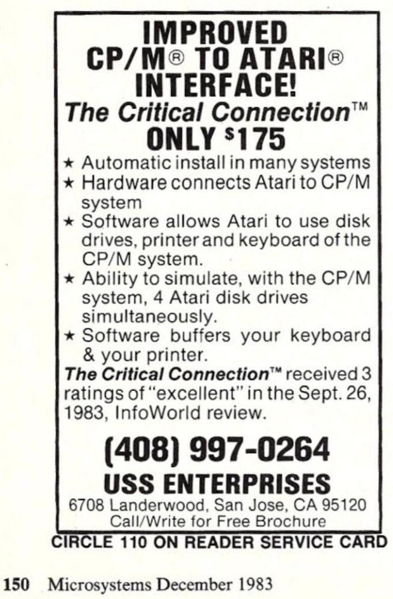
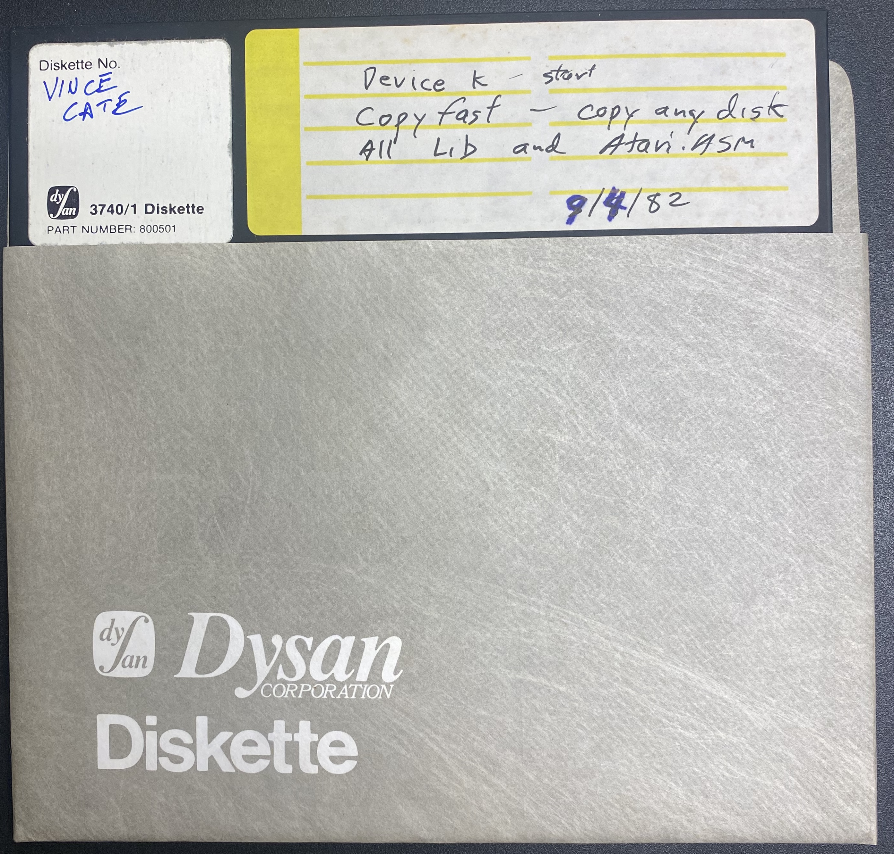

# Critical Connection for Atari 8-bit and CP/M
Source code for Critical Collection, software/hardware for connecting an Atari 8-bit to a CP/M machine

Critical Connection was a combination of a specialized cable and software for connecting an Atari 8-bit to a computer running CP/M. The long cable had an SIO plug on one end and a 25-pin serial port on the other, and some chips in the middle, allowing the Atari and CP/M box to communicate at 19,200 bps. It was created by Vince Cate, who sent me the source code on 8" floppy disk, and has released the code under the MIT license. The disk is dated September 4, 1982.

Features of the Critical Connection: use an entire CP/M floppy disk as an emulated 600K Atari disk drive, create 92KB CP/M disk files which emulated Atari 90KB disks, and print from the Atari to the CP/M computer's printer (the CP/M machine even acted as a print spooler), use the CP/M machine's keyboard to type on the Atari.

The .MAC and .LIB files are for the CP/M side. The .ASM files are for the Atari side (these had the extension .ATR on the floppy disk. I renamed them to .ASM to avoid confusion with the Atari ATR file format that came years after this was written.)

My interview with Vince: https://www.youtube.com/watch?v=5xfe-CJ6BM0

Critical Connection manual: https://archive.org/details/the-critical-connection-manual

Vince's web site: http://www.offshore.com.ai/vince/

Vince in Wikipedia: https://en.wikipedia.org/wiki/Vince_Cate

Critical Connection review in A.N.A.L.O.G. magazine 1986-02: https://archive.org/details/analog-computing-magazine-39/page/n112/mode/1up

